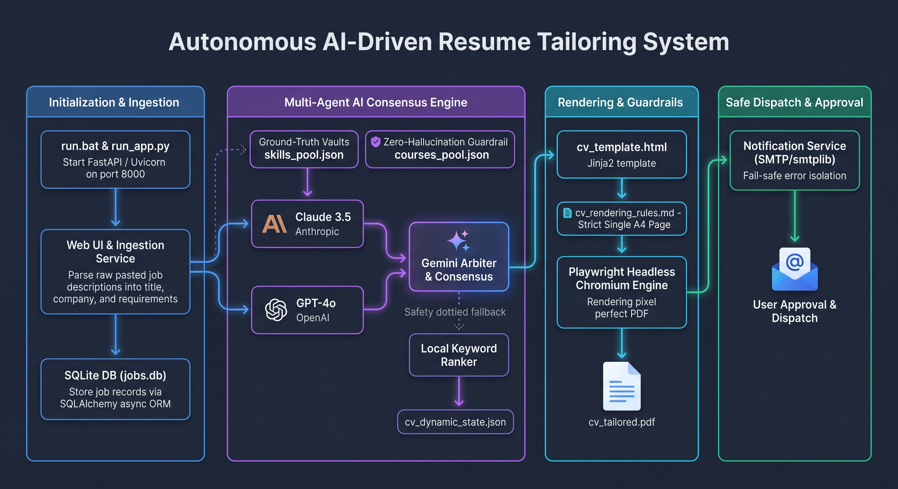

# Resume Tailoring Pipeline 🚀


<div align="center">
  
</div>

An advanced, locally-hosted system designed to automate the job search and resume tailoring process. The system ingests job descriptions, tailors the user's resume dynamically using a **Multi-Agent AI Consensus**, generates a pixel-perfect PDF, and securely emails it to the user for human-in-the-loop approval.

---

## 🏗️ System Architecture Summary

The project is structured into six highly decoupled modules:

### Module 1: Entry Points & App Initialization
* **`run.bat` / `run_app.py`:** The main entry points. Configures Windows asyncio policies (preventing Playwright/DB background process crashes) and launches the Uvicorn ASGI server.
* **`api/main.py`:** The FastAPI application instance. Manages the server lifespan, ensures database integrity on startup, serves static UI files, and mounts all REST routers.

### Module 2: Database Layer & Models
* **`jobs.db`:** Local SQLite database accessed asynchronously.
* **`db/base.py` / `db/init_db.py`:** Establishes the async connection engine via SQLAlchemy 2.0 and `aiosqlite`, providing safe concurrent session management (`AsyncSessionLocal`).
* **`db/models.py`:** ORM definitions for `Job` (job details, status) and `CVTailored` (selected skills, PDF path, AI mode audit).
* **`api/schemas.py`:** Pydantic models for strict input/output validation.

### Module 3: Core API Endpoints
* **`api/deps.py`:** Dependency Injection (e.g., `get_db()`) to safely open and auto-close database sessions per request, preventing memory leaks.
* **`api/routers/jobs.py`:** RESTful endpoints (`POST /api/jobs`, `GET /api/jobs`, `POST /api/jobs/{id}/tailor`) serving the frontend.

### Module 4: Ingestion & Notification Services
* **`services/ingestion_service.py`:** Receives raw, messy job text and extracts core fields using heuristics (non-AI dependent) for lightning-fast, zero-cost processing.
* **`services/notification_service.py`:** A fail-safe SMTP notification service. Emails the finalized PDF to the user's inbox, ensuring the main app loop never crashes even on network failure.

### Module 5: The AI Tailoring Engine & Consensus
* **Zero-Hallucination Guardrails:** The system strictly reads from authentic ground-truth files (`data/skills_pool.json`, `data/courses_pool.json`). The AI is permitted to *select and rank*, but **never fabricate**.
* **Triple-Agent Consensus (`services/tailor_skills.py`):**
  1. Runs **Claude 3.5** and **GPT-4o** in parallel.
  2. Submits both proposals to **Gemini (Arbiter)** to merge and determine the optimal tailoring strategy.
  3. Features a Graceful Degradation hierarchy: Arbiter Failure ➔ Strict Rule Tiebreaker ➔ Single Agent ➔ Local Deterministic Ranker (No-AI).
* **`services/tailor_service.py`:** Orchestrates the process and saves the final outcome to `data/cv_dynamic_state.json`.

### Module 6: PDF Generation & Guardrails
* **`templates/cv_template.html`:** A Jinja2-based HTML/CSS template enforcing strict separation between content and design.
* **`docs/cv_rendering_rules.md`:** Binding rules ensuring the CV perfectly fits a single A4 page with no text clipping.
* **Playwright (Headless Chromium):** Loads the injected HTML and renders a pixel-perfect PDF behind the scenes.

---

## 🔄 End-to-End Data Pipeline

```text
===================================================================================
                       PHASE 1: Job Ingestion & Storage
===================================================================================
  [ User pastes job description into UI and clicks "Save Job" ]
                          │
             [ POST /api/jobs (FastAPI) ]
                          │
       ┌──────────────────┼──────────────────┐
       ▼                  ▼                  ▼
[ api/schemas.py ] [ ingestion_service ]   [ api/deps.py ]
(Input Validation) (Extract Title/Comp)  (Secure DB Session)
                          │
                          ▼
             [ Saved to jobs.db (Status: PENDING) ]


===================================================================================
                       PHASE 2: AI Tailoring Engine
===================================================================================
  [ User clicks "Tailor CV for this job" in UI ]
                          │
       [ POST /api/jobs/{id}/tailor (FastAPI) ]
                          │
                          ▼
            [ services/tailor_service.py ]
                          │
       ┌──────────────────┴──────────────────┐
       ▼                                     ▼
[ skills_pool.json ]                 [ tailor_skills.py ]
[ courses_pool.json]                (AI Committee Active)
(Locked Ground-Truth)                        │
                               ┌─────────────┴─────────────┐
                               ▼                           ▼
                       [ Claude 3.5 ]             [ GPT-4o ]
                        (Parallel)                (Parallel)
                               │                           │
                               └─────────────┬─────────────┘
                                             ▼
                                  [ Gemini (Arbiter) ]
                          (Consensus & Optimal Version Selection)
                                             │
                                             ▼
                                 [ cv_dynamic_state.json ]
                                (Updated Resume Draft State)
                                             │
                                             ▼
                   [ jobs.db updated (Status: TAILORED + Agent Mode) ]


===================================================================================
                       PHASE 3: PDF Generation & Dispatch
===================================================================================
                        [ cv_dynamic_state.json ]
                                     │
                                     ▼
                         [ templates/cv_template.html ]
                        (Inject skills/courses into HTML)
                                     │
                                     ▼
                            [ Playwright Engine ]
                      (Headless Chromium renders HTML)
                                     │
                                     ▼
                            [ tailored_cv.pdf ]
                                     │
                                     ▼
                    [ services/notification_service.py ]
                     (Secure SMTP payload transmission)
                                     │
                                     ▼
               📬 [ Tailored PDF delivered to user's inbox! ]
===================================================================================
```

## 📁 Repository Structure

```text
Root/
├── api/             # FastAPI routers, schemas, dependencies, and main.py
├── assets/          # Personal baseline assets (original CV, transcripts)
├── data/            # Ground-truth JSONs (skills_pool, courses_pool, dynamic state)
├── db/              # SQLAlchemy models, SQLite database init & sessions
├── docs/            # Architecture state and strict rendering rules
├── output/          # Generated assets (Rendered PDFs, HTMLs, Reports)
├── scripts/         # Utility scripts (Visual QA Loop, systemd services)
├── services/        # Core business logic (Tailoring, Ingestion, Notifications)
├── static/          # Frontend Web UI (index.html, JS, CSS)
├── templates/       # Frozen Jinja2 CV HTML template and strict CSS styling
├── run.bat          # Windows startup script
└── run_app.py       # Main application launcher
```

## 🚀 Getting Started

1. Clone this repository.
2. Ensure you have Google Chrome / Chromium installed (for Playwright).
3. Create a `.env` file in the root directory and configure your API Keys (Anthropic, OpenAI, Google) and SMTP credentials.
4. Run `pip install -r requirements.txt`.
5. Run `run.bat` (or `python run_app.py`).
6. The UI will automatically open in your default browser at `http://127.0.0.1:8000/`.